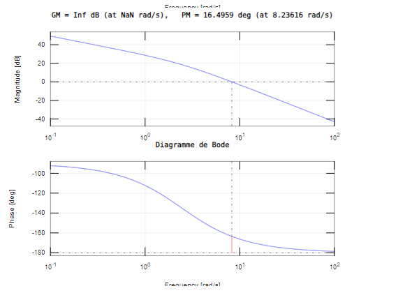
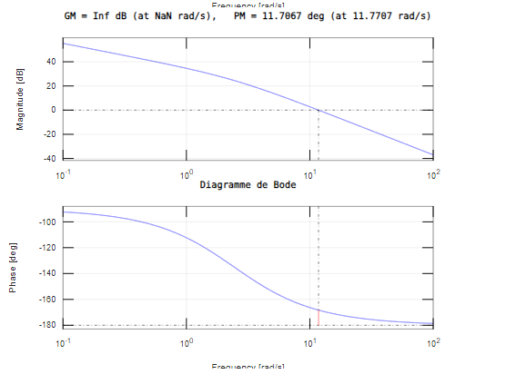
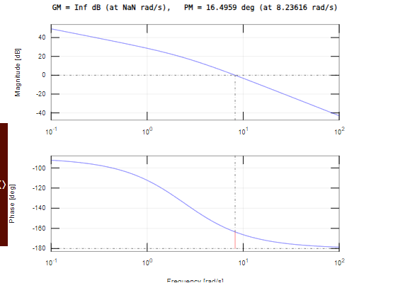
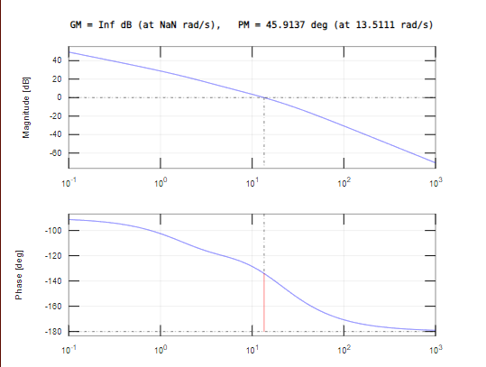
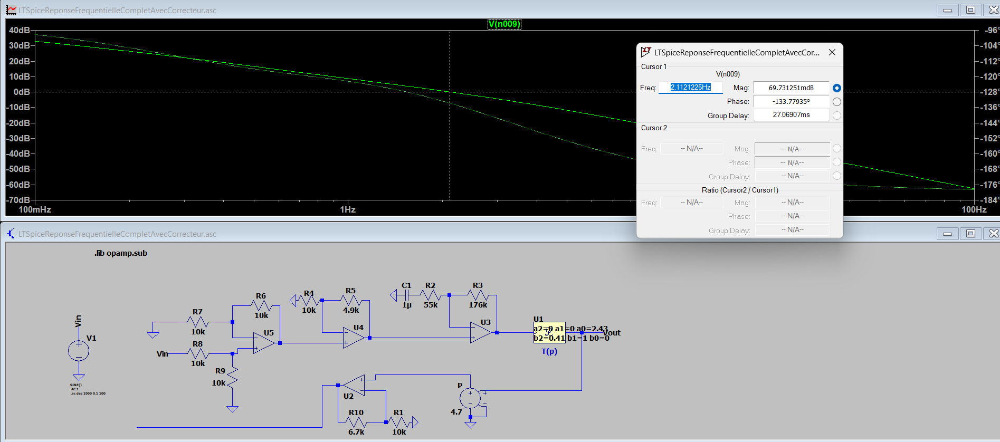

# TP Mécatronique

## Sommaire


## III
### a


### b


### Valeur quand a
Start :1072
0 : 3978 
1 : 2601 
2 : 3235 
3 : 2977 
End :3000
Dépassement de :50.73%
TR 5% : 1510 ms
A : 3.02
teta : 0.33


### calculer les valeurs de A et teta


## IV
### A
#### 1
```
% Définition des paramètres
A = 2.4300;
Tau = 0.4100;
Ka= 30/(2*pi);
Ab = 1;
Ad = 1;
% Création de la fonction de transfert T(p)
s = tf('s');
T = A/(s* (1 + Tau * s));
% Création de la fonction de transfert en boucle ouverte
FTBO = T * Ab * Ad * Ka;
% Diagramme de Bode
figure;
margin (FTBO);
title('Diagramme de Bode');
% Diagramme de Black-Nichols
figure;
nichols (FTBO);
title('Diagramme de Black-Nichols');
```


#### 2
    𝜃(𝑝) = 8/p * FTBF


    𝑙𝑖𝑚(𝑡→∞)𝜃(𝑡)  

            = 𝑙𝑖𝑚(𝑝→0)𝑝𝜃(𝑝) 

            = 𝑙𝑖𝑚(𝑝→0) 8/p * FTBF * p²
            
            = 8 / k * Ab 

#### 3
    𝜀 = Ve - Us
    Us = Ad * Ab * T(p) * K * 𝜀
    Us = Ad * Ab * (A/p(1+tp)) * K * 𝜀
    
    𝜀 = Ve - Ad * Ab * (A/p(1+tp)) * K * 𝜀
    
    𝜀 = Ve / (1 + Ad * Ab * (A/p(1+tp)) * K)
    
    𝑙𝑖𝑚(𝑡→∞)𝜀(𝑡)    
                = 𝑙𝑖𝑚(𝑝→0)𝑝𝜀(𝑝)
                = 𝑙𝑖𝑚(𝑝→0)𝑝 * Ve / (1 + Ad * Ab * (A/p(1+tp)) * K)
                = 0

#### 4


### B

#### 1




#### 2

 

                    

### C

#### 1


#### 2

```
A = 2.4300;
Tau = 0.4100;
Ka = 30/(2*pi);
Ab = 1;
Ad = 2.5;
a = 4.2;
t = 0.45/8.23;
% Création de la fonction de transfert T(p)
s = tf('s');
T = A/(s* (1 + Tau * s));

FTBO = T*Ab*Ad*Ka;
margin(FTBO)

Cp = (1+a*t*s)/(1+t*s)

bode(Cp);

% Création de la fonction de transfert en boucle ouverte
FTBO = T*Ab*Ad*Ka*Cp;
% Diagramme de Bode
figure;
margin (FTBO);
title('Diagramme de Bode');
% Diagramme de Black-Nichols
figure;
nichols (FTBO);
title('Diagramme de Black-Nichols');
```


## V

### A

#### 1

##### Temporel


##### Fréquentiel


#### 2


#### 3
(facultaif)


#### 4



### B

#### 1

##### i


##### ii


##### iii

```
A = 2.4300;
Tau = 0.4100;
Ka = 30/(2*pi);
Ab = 1;
Ad = 1;
a = 2.4;
t = 0.65/6.40;
% Création de la fonction de transfert T(p)
s = tf('s');
T = A/(s* (1 + Tau * s));
Cp = (1+a*t*s)/(1+t*s);


bode(Cp);

% Define the sampling time
Ts = 0.01; % for example

% Apply the Tustin transformation
Cp_discrete = c2d(Cp, Ts, 'tustin');

% Now you can plot the Bode plot of the discrete-time system
Cp_discrete
```


##### iv

```py
class updateCp() :
    def __init__(self):
        self.PreviousL_epsilon = 0
        self.PreviousCp = 0
        self.l_epsilon = 0
        self.Cp = 0

    def updateCp(self, p_refValueIn, p_motorOut):
        Ab = 1
        Ad = 2.5
        A = 2.334
        B = -2.24
        C = 0.9062

        self.l_epsilon = ((p_refValueIn * Ab) - p_motorOut)

        self.Cp = ((A * self.l_epsilon) + (B * self.PreviousL_epsilon) + (C * self.PreviousCp))
        self.PreviousL_epsilon = self.l_epsilon
        self.PreviousCp = self.Cp
        self.l_epsilon = (self.l_epsilon * Ad) + self.Cp
        if (self.l_epsilon > 32000):
            self.l_epsilon = 32000
        elif (self.l_epsilon < -32000):
            self.l_epsilon = -32000
        return self.l_epsilon

    def getPreviousL_epsilon(self):
        return self.PreviousL_epsilon

    def getPreviousCp(self):
        return self.PreviousCp

    def getL_epsilon(self):
        return self.l_epsilon

    def getCp(self):
        return self.Cp

    def controlLoop(p_refValueIn,p_motorOut):
    
        #TODO PID calculation algorithm
        l_epsilon = updateCp1.updateCp(p_refValueIn, p_motorOut)
    
        l_outPid=l_epsilon*g_pidP* 0.610
        return l_outPid

g_data1=[]
updateCp1 = updateCp()

g_pidP=1
```
