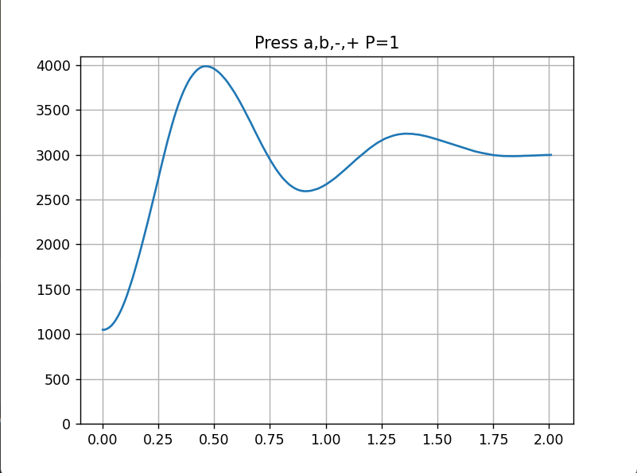
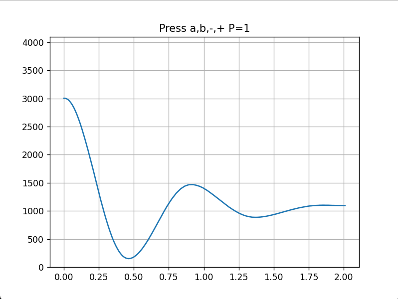
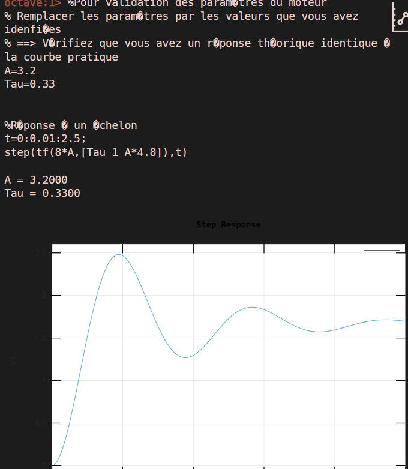

# TP Mécatronique

## Sommaire

## V1
### a

### b

### Valeur quand a
Start :1072
0 : 3978 
1 : 2601 
2 : 3235 
3 : 2977 
End :3000
Dépassement de :50.73%
TR 5% : 1510 ms
A : 3.02
teta : 0.33

### calculer les valeurs de A et teta

