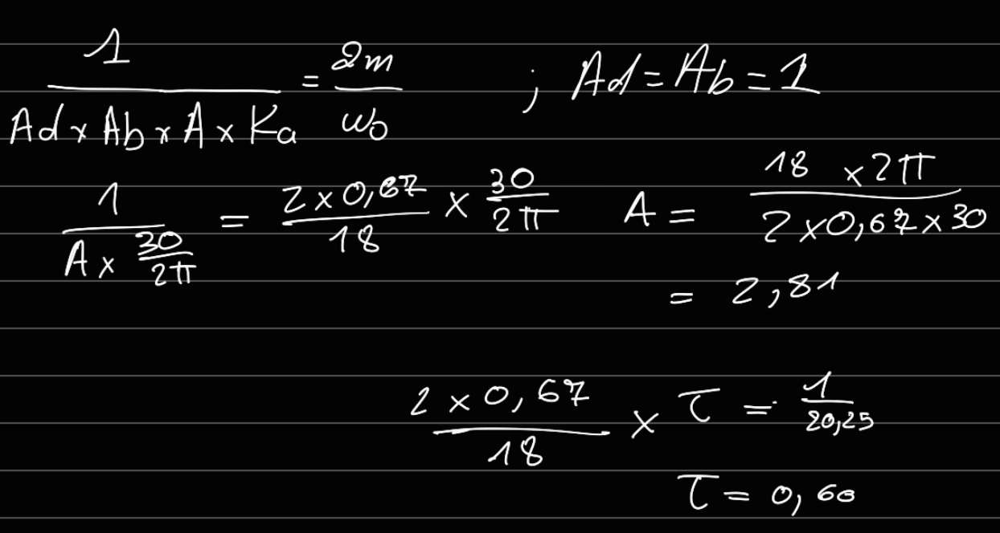

# TP Mécatronique

## Sommaire

## V1
### a

### b

### Valeur quand a
Start :1089
D0 : 3954 
D1 : 2624 
D2 : 3217 
D3 : 2986 
End :3002
Coef amortissement :0.67
TR 5% : 260 ms

### calculer les valeurs de A et teta

