# TP Mécatronique

## Sommaire


## III
### a


### b


### Valeur quand a
Start :1072
0 : 3978 
1 : 2601 
2 : 3235 
3 : 2977 
End :3000
Dépassement de :50.73%
TR 5% : 1510 ms
A : 3.02
teta : 0.33


### calculer les valeurs de A et teta


## IV
### A
#### 1
```
% Définition des paramètres
A = 2.4300;
Tau = 0.4100;
Ka= 30/(2*pi);
Ab = 1;
Ad = 1;
% Création de la fonction de transfert T(p)
s = tf('s');
T = A/(s* (1 + Tau * s));
% Création de la fonction de transfert en boucle ouverte
FTBO = T * Ab * Ad * Ka;
% Diagramme de Bode
figure;
margin (FTBO);
title('Diagramme de Bode');
% Diagramme de Black-Nichols
figure;
nichols (FTBO);
title('Diagramme de Black-Nichols');
```

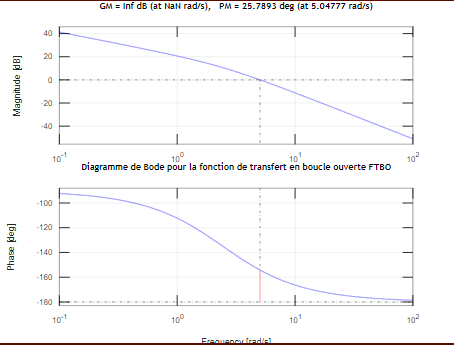

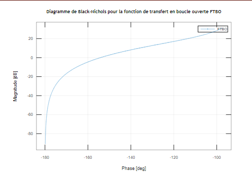

#### 2
    𝜃(𝑝) = 8/p * FTBF


    𝑙𝑖𝑚(𝑡→∞)𝜃(𝑡)  

            = 𝑙𝑖𝑚(𝑝→0)𝑝𝜃(𝑝) 

            = 𝑙𝑖𝑚(𝑝→0) 8/p * FTBF * p²
            
            = 8 / k * Ab 

#### 3
    𝜀 = Ve - Us
    Us = Ad * Ab * T(p) * K * 𝜀
    Us = Ad * Ab * (A/p(1+tp)) * K * 𝜀
    
    𝜀 = Ve - Ad * Ab * (A/p(1+tp)) * K * 𝜀
    
    𝜀 = Ve / (1 + Ad * Ab * (A/p(1+tp)) * K)
    
    𝑙𝑖𝑚(𝑡→∞)𝜀(𝑡)    
                = 𝑙𝑖𝑚(𝑝→0)𝑝𝜀(𝑝)
                = 𝑙𝑖𝑚(𝑝→0)𝑝 * Ve / (1 + Ad * Ab * (A/p(1+tp)) * K)
                = 0

#### 4

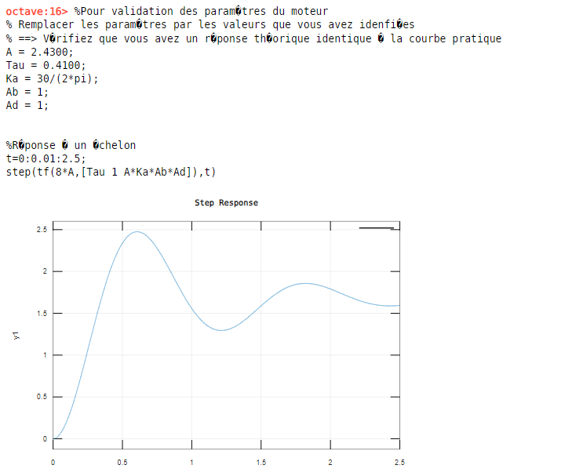

### B

#### 1

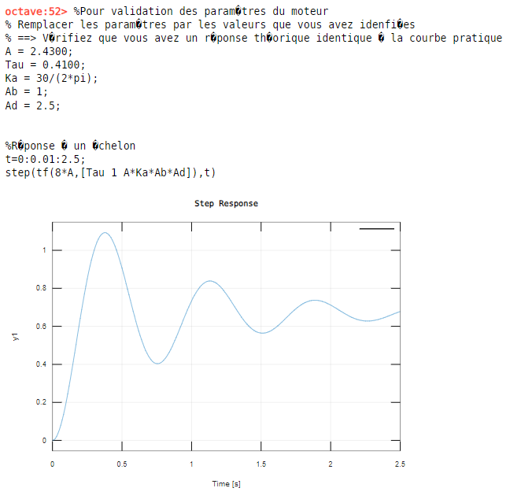

#### 2

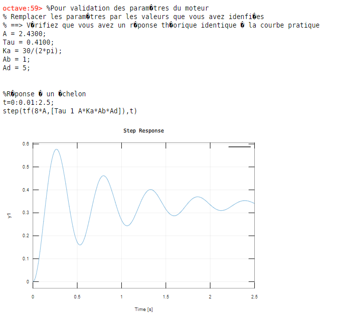 
                    

### C

#### 1

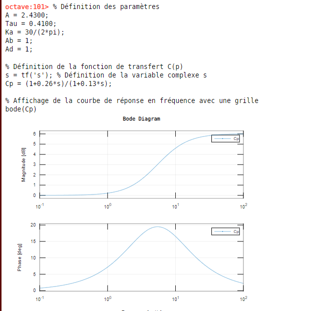

#### 2

```
A = 2.4300;
Tau = 0.4100;
Ka = 30/(2*pi);
Ab = 1;
Ad = 1;
a = 2.4;
t = 0.65/6.40;
% Création de la fonction de transfert T(p)
s = tf('s');
T = A/(s* (1 + Tau * s));
Cp = (1+a*t*s)/(1+t*s)
% Création de la fonction de transfert en boucle ouverte
FTBO = T*Ab*Ad*Ka*Cp;
% Diagramme de Bode
figure;
margin (FTBO);
title('Diagramme de Bode');
% Diagramme de Black-Nichols
figure;
nichols (FTBO);
title('Diagramme de Black-Nichols');

Transfer function 'Cp' from input 'u1' to output ...

      0.2437 s + 1
 y1:  ------------
      0.1016 s + 1

Continuous-time model.
```

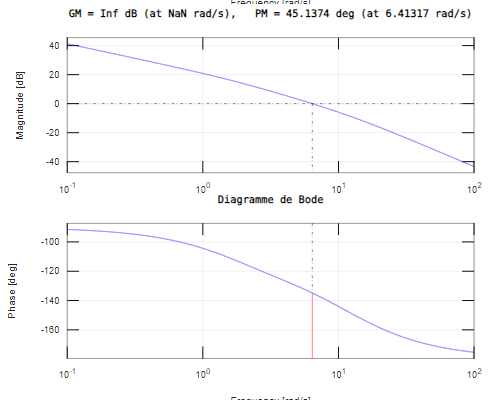

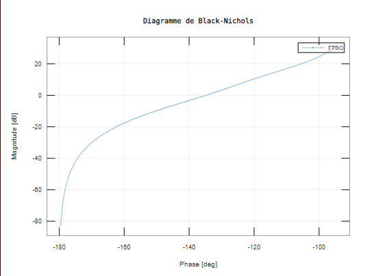

## V

### A

#### 1

##### Temporel
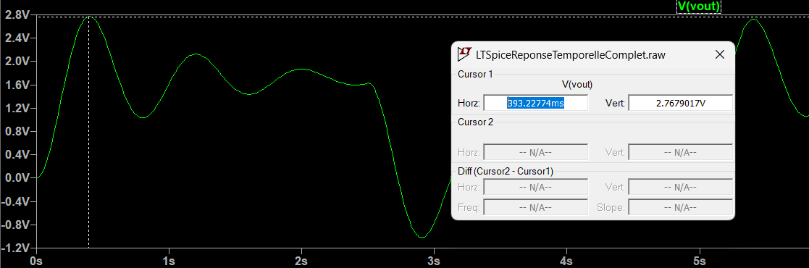
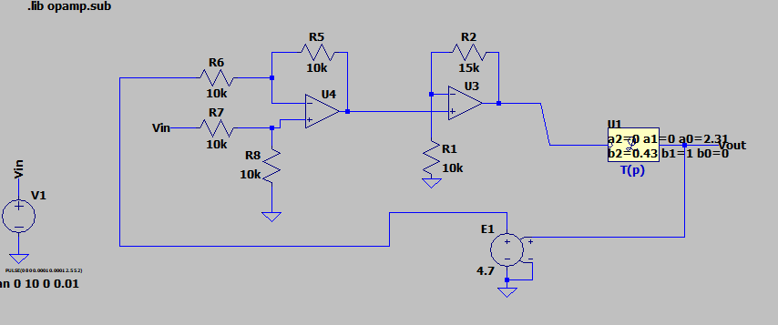


##### Fréquentiel
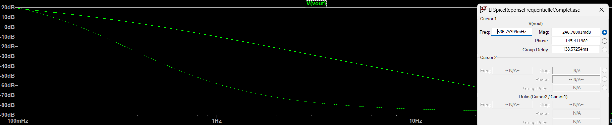


#### 2
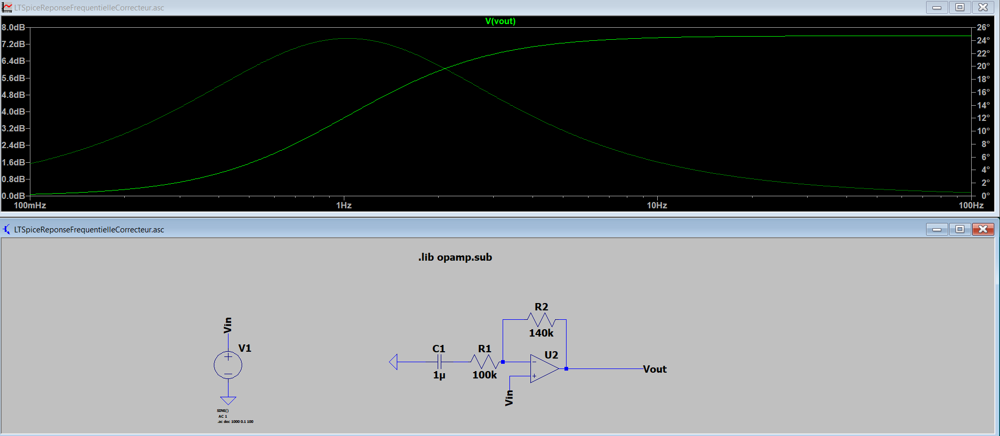
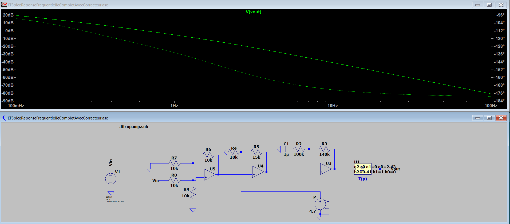
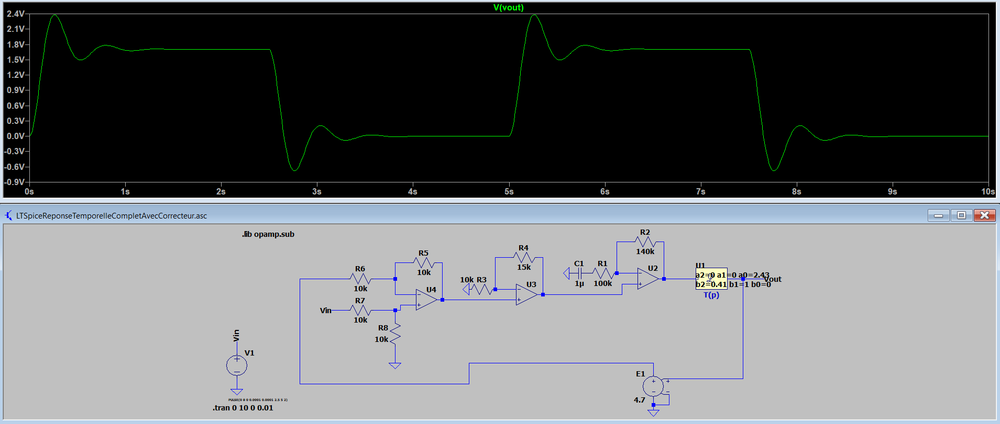

#### 3
(facultaif)


#### 4
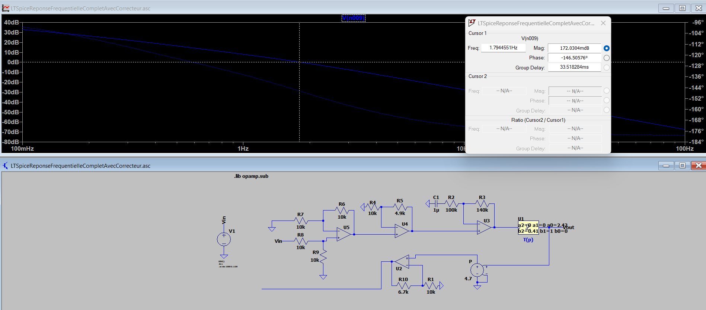
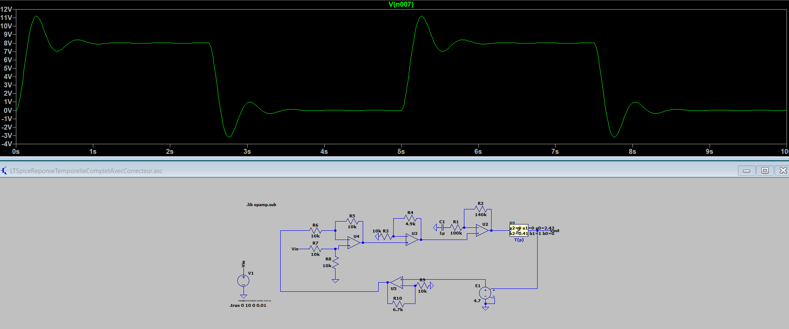

### B

#### 1

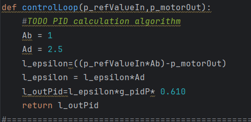

#### 2

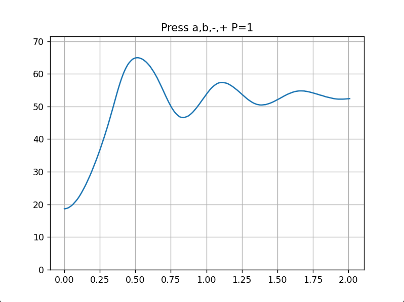

#### 3

```
A = 2.4300;
Tau = 0.4100;
Ka = 30/(2*pi);
Ab = 1;
Ad = 1;
a = 2.4;
t = 0.65/6.40;
% Création de la fonction de transfert T(p)
s = tf('s');
T = A/(s* (1 + Tau * s));
Cp = (1+a*t*s)/(1+t*s);


bode(Cp);

% Define the sampling time
Ts = 0.01; % for example

% Apply the Tustin transformation
Cp_discrete = c2d(Cp, Ts, 'tustin');

% Now you can plot the Bode plot of the discrete-time system
Cp_discrete
```
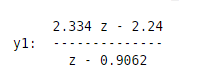

